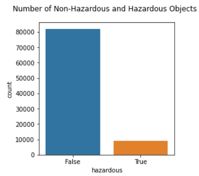
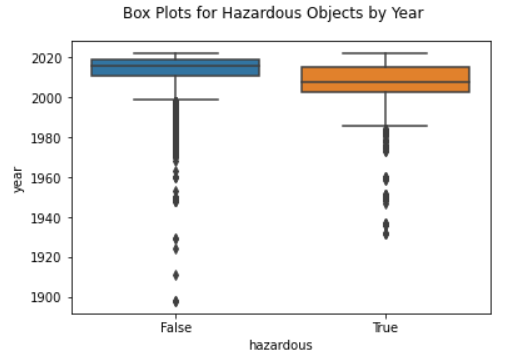

# NASA Nearest Earth Objects Analysis Project by Alyssa Soderlund

This is a simple exploration, analysis, and model building project I created in Python 3. 

See a project I created in R here: ([Wine Analysis Project](https://asoderlund.github.io/WineAnalysis/)).

## The Dataset
The dataset comes from the NASA Open API and NEO Earth Close Approaches. It can be found on Kaggle here: ([Data](https://www.kaggle.com/datasets/sameepvani/nasa-nearest-earth-objects)). I am using version 2 of this dataset.

This dataset contains information about asteroids orbiting earth. It is important to understand objects close to earth, as they can impact the earth in many ways and distrupt the earths natural phenomena. Information about the size, velocity, distance from earths orbit, and the magnitude of the luminosity of the asteroid can help experts identify whether an asteroid poses a threat or not. This project will analyze information about these asteroids, and attempt to create a model to predict whether or not an asteroid is potentially hazardous.

The attributes of this dataset are: 
- *id*: identifier (the same object can have several rows in the dataset, as it has been observed multiple times)
- *name*: name given by NASA (including the year the asteroid was discovered)
- *est_diameter_min*: minimum estimated diameter in kilometers
- *est_diameter_max*: maximum estimated diameter in kilometers
- *relative_velocity*: velocity relative to earth
- *miss_distance*: distance in kilometers it misses Earth
- *orbiting_body*: planet that the asteroid orbits
- *sentry_object*: whether it is included in sentry - an automated collision monitoring system
- *absolute_magnitude*: intrinsic luminosity
- *hazardous*: whether the asteriod is potentially harmful or not

## Exploratory Data Analysis and Pre-processing
This dataset has 10 columns and 90,836 rows. It has no missing values. Peeking at the first 10 rows of data reveals what the data looks like:


_Table 1_


A cursory examination of the dataset shows that *orbiting_body* and *sentry_object* each only have 1 unique value, so they are dropped from the table.

We also see that id and name each only have 27423 unique values. This means that the same asteroid is measured multiple times. Let's take a look at one of these asteroids to see what changes with each record:


_Table 2_

Looking at Table 2, it appears that *relative_velocity* and *miss_distance* change with each observation of the same asteroid. A large majority of the time, the classification of *hazardous* does not change with each observation.

We would assume intuitively that most of these asteroids are not hazardous, because if most asteroids were hazardous we would probably have a lot more collisions with them! The imbalance is not too extreme though- about 9.7% of objects are classified as hazardous. This can be handled with a stratified train-test split later on.


_Figure 1_

Next, a correlation heatmap in Figure 2 shows that *est_diameter_min* and *est_diameter_max* are perfectly correlated. This means we only need to keep one of these variables, so we will drop *est_diameter_min*.


_Figure 2_

Next, I was curious about the year that is included in the names of each asteroid. I decided to extract the year from the *name* variable to see if there is any pattern with the year the asteroid was discovered.

<details><summary markdown="span">**Click Here** to see my code for extracting the year from the name.</summary>
```python
df[['drop','temp']]=df.name.str.split('(',expand=True)
df.drop(columns='drop',inplace=True)

def get_year(x):
    return x.strip()[0:x.strip().index(' ')]
df['year']=df['temp'].apply(get_year)

df.drop(columns='temp', inplace=True)

df.loc[df.year=='A911','year']='1911' 
df.loc[df.year=='6743','year']='1960'
df.loc[df.year=='A898','year']='1898'
df.loc[df.year=='6344','year']='1960'
df.loc[df.year=='A924','year']='1924'
df.loc[df.year=='A/2019','year']='2019'
df.loc[df.year=='4788','year']='1960'
  
df.year=df.year.astype(int)
```
</details>
<br/>
To see if there is any pattern, I created boxplots for hazardous and non-hazardous asteroids based on the year. Based on the boxplots in figure 3, hazardous objects were mostly discovered between around 2002 to before 2020. There were many non-hazardous objects discovered pre-1980s. 

Possible reasons why hazardous objects were not discovered until more recently could be that hazardous asteroids tend to be farther away (as we will discover from figure 5), and it is possible that older equipment could not detect asteroids that are further away from earth as well. Another possible reason is that hazardous objects tend to have a lower absolute magnitude (also infered from figure 5), or luminosity, making them even harder to detect with older equipment.



_Figure 3_


## Univariate and Bivariate Analysis
To perform univariate and bivariate analysis, I began by extracting the numerical columns, not including id. 

First I checked the distribution of the variables, showwn in figure 4. First, notice that the distribution for estimated maximum diameter is highly positively skewed with sharp spike on the left, indicating the presence of outliers. Relative velocity has a positive skew, so most asteroids are moving more slowly. The distance from earth, *miss_distance*, seems to be relatively uniform throughout the data, with a bit of a spike at 0. Finally, we see that most observations of asteroids were recorded after 1990, so data from before 1990 might not be as useful.


_Figure 4_

For bivariate analysis, I started with a pairs plot that is colored by *hazardous* classification (figure 5). There are a lot of interesting patterns revealed by these plots. 

First, the distributions along the diagonal are interesting because they add more information to our univariate analysis concerning the classification of asteroids as hazardous. From the relative velocity distribution, it seems that hazardous asteroids move slightly faster than non-hazardous ones. From the distributions of *miss_distance* and *absolute_magnitude*, we see that hazardous asteroids actually tend to be further away from earth, which is counter-intuitive. There is also a very clear correlation between *est_diameter_max* and *absolute_magnitude*, so it may be beneficial to only include one of these variables for certain models.


_Figure 5_

## Model Building

I chose to create classification models to predict whether or not an asteroid is considered hazardous. To compare models, I included accuracy, precision, recall, f1, and AUC scores. I chose to include all of these metrics because certain models performed better for some of these metrics and worse for others. In this case, recall is going to be more important than precision (or even accuracy, to a degree) because mis-classifying a dangerous asteroid as non-hazardous is a much more costly mistake that mis-classifying a non-hazardous asteroid. So, if a model performs better in recall and worse for other metrics, it may be something to take into account.

### More Pre-Processing

Before building any models, I performed a test/train split, with 80% of the data going to the test set. I stratified y (the *hazardous* variable) to account for the class imbalance. I did not include *name* or *id* in the X values because they were not useful. I decided to keep both *estimated_diameter_max* and *absolute_magnitude*, because most of the metrics were improved by including both variables. However, if we were trying to optimize recall only, it would help with certain models to only use one of these variables. 


### Basic Decision Tree Classification


### K Nearest Neighbors Classification


### Random Forest Decision Tree Classification


### Gradient Boosted Decision Tree Classification

# Final Results and Final Remarks
